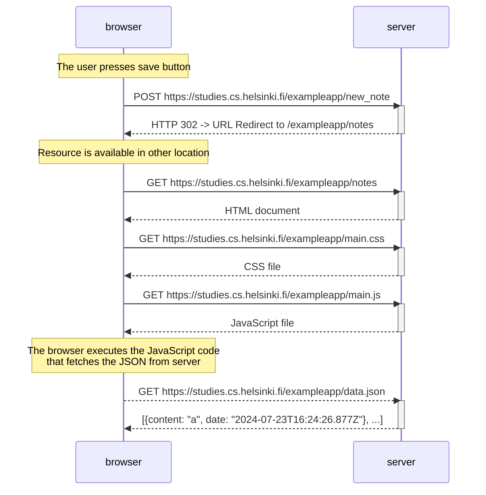

```mermaid
sequenceDiagram
    participant browser
    participant server

    Note over browser: The user presses save button

    browser->>server: POST https://studies.cs.helsinki.fi/exampleapp/new_note
    activate server
    server-->>browser: HTTP 302 -> URL Redirect to /exampleapp/notes   
    deactivate server

    Note over browser: Resource is available in other location

    browser->>server: GET https://studies.cs.helsinki.fi/exampleapp/notes
    activate server
    server-->>browser: HTML document
    deactivate server

    browser->>server: GET https://studies.cs.helsinki.fi/exampleapp/main.css 
    activate server
    server-->>browser: CSS file
    deactivate server

    browser->>server: GET https://studies.cs.helsinki.fi/exampleapp/main.js
    activate server
    server-->>browser: JavaScript file
    deactivate server

    Note over browser: The browser executes the JavaScript code<br/>that fetches the JSON from server

    browser-->>server: GET https://studies.cs.helsinki.fi/exampleapp/data.json
    activate server
    server-->>browser: [{content: "a", date: "2024-07-23T16:24:26.877Z"}, ...]
    deactivate server
    
```
