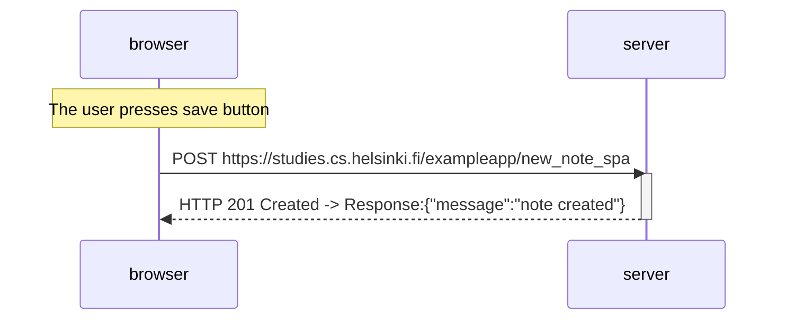

```mermaid
sequenceDiagram
    participant browser
    participant server

    Note over browser: The user presses save button

    browser->>server: POST https://studies.cs.helsinki.fi/exampleapp/new_note_spa
    activate server
    server-->>browser: HTTP 201 Created -> Response:{"message":"note created"}
    deactivate server
```
